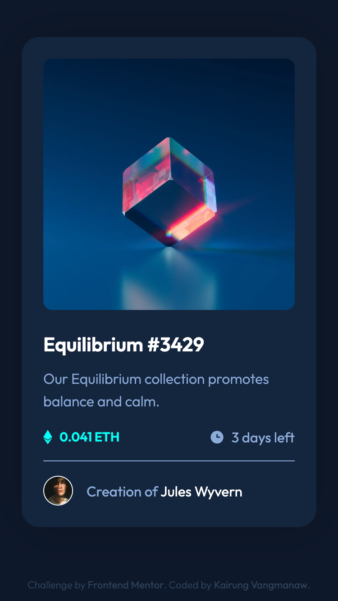
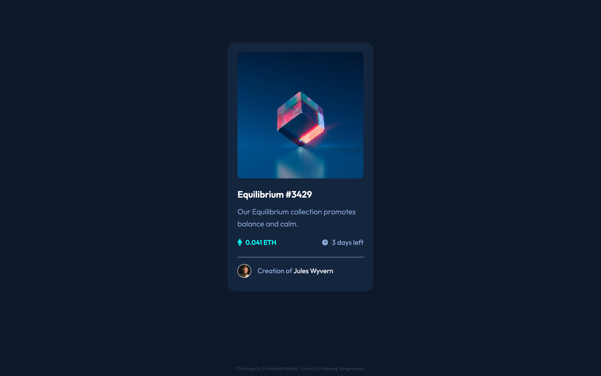
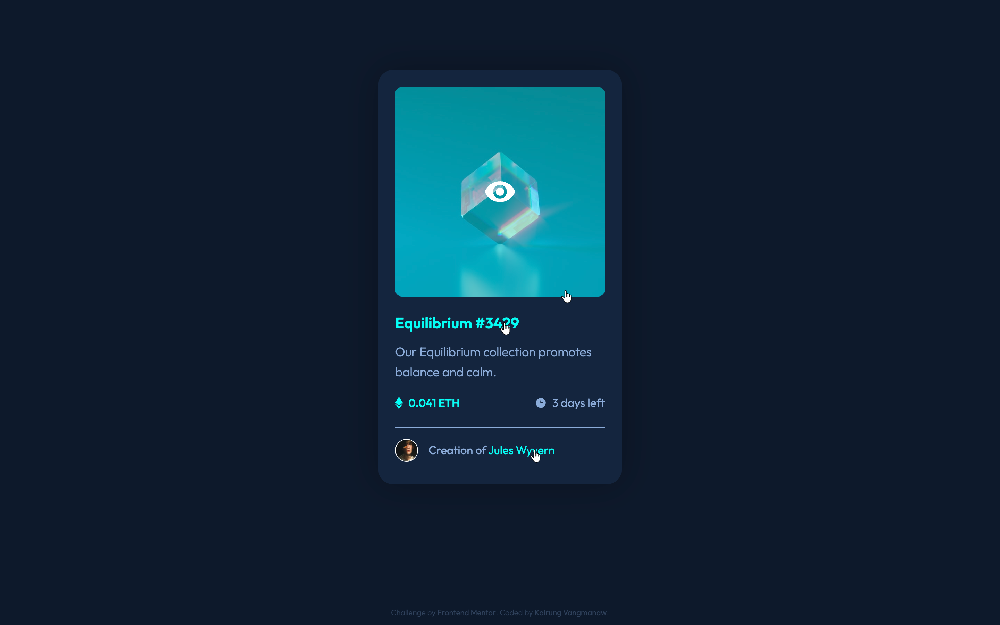

# Frontend Mentor - NFT preview card component solution


This is a solution to the [NFT preview card component challenge on Frontend Mentor](https://www.frontendmentor.io/challenges/nft-preview-card-component-SbdUL_w0U). Frontend Mentor challenges help you improve your coding skills by building realistic projects. 

## Table of contents

- [Frontend Mentor - NFT preview card component solution](#frontend-mentor---nft-preview-card-component-solution)
  - [Table of contents](#table-of-contents)
  - [Overview](#overview)
    - [The challenge](#the-challenge)
    - [Screenshot](#screenshot)
    - [Links](#links)
  - [My process](#my-process)
    - [Built with](#built-with)
    - [What I learned](#what-i-learned)
    - [Continued development](#continued-development)
    - [Useful resources](#useful-resources)
  - [Author](#author)
  - [Acknowledgments](#acknowledgments)

## Overview

### The challenge

Users should be able to:

- View the optimal layout depending on their device's screen size
- See hover states for interactive elements

### Screenshot

<details>
  <summary>Mobile view</summary>
  
</details>
<details>
  <summary>Desktop view</summary>
  
</details>
<details>
  <summary>Active state view</summary>
  
</details>

### Links

- Solution URL: [Add solution URL here](https://your-solution-url.com)
- Live Site URL: [Add live site URL here](https://your-live-site-url.com)

## My process

### Built with

- Semantic HTML5 markup 
- CSS custom properties
- CSS Native Nesting
- Flexbox
- Mobile-first workflow
- BEM Methodology
- [React](https://react.dev/) - JavaScript library for building UI components  
- [Vite](https://vite.dev/) - Next Generation Frontend Tooling

### What I learned

Although I had previously used `position: absolute` quite often, I hadn't truly combined it with `position: relative` on a parent container until this project. I gained a much clearer understanding of how `position: absolute` anchors itself to its nearest positioned ancestor (`position: relative`).

I applied this concept to build an image hover overlay effect by setting `.card__image-link` to `position: relative` and positioning `.card__overlay` using `position: absolute` with `inset: 0`.

```css
.card__image-link {
  position: relative;
  border-radius: 10px;
  overflow: hidden;
}

.card__overlay {
  position: absolute;
  inset: 0;
  background-color: var(--clr-primary-cyan-400);
  display: flex;
  justify-content: center;
  align-items: center;
  opacity: 0;
  transition: opacity 0.3s ease-in-out;
}

.card__image-link:hover .card__overlay,
.card__image-link:focus-visible .card__overlay {
  opacity: 1;
}
```

Additionally, I reinforced my knowledge of Semantic HTML structure by organizing layout landmarks correctly (`<main>` wrapping the main page layout, `<article>` for reusable card components, and `<time dateTime="...">` for accessible dates) while maintaining a solid accessibility baseline using `aria-hidden` and `:focus-visible`.

### Continued development

In future development, I would like to:  

- Implement a feature where clicking on the NFT image expands it into a larger modal view, instead of only showing an overlay icon on hover.  

- Extend the project to support multiple NFT cards, and add navigation controls (such as arrows or a carousel) so users can browse through them interactively.  

### Useful resources

- [MDN Web Docs - Positioning](https://developer.mozilla.org/en-US/docs/Learn_web_development/Core/CSS_layout/Positioning) - Excellent guide for mastering `position: relative` and `position: absolute` layouts.
  
- [WAI-ARIA Basics - MDN](https://developer.mozilla.org/en-US/docs/Learn_web_development/Core/Accessibility/WAI-ARIA_basics) - Helpful reference for implementing accessibility standards, decorative alt text, and `aria-hidden` attributes.  

- [Modern CSS Reset by Andy Bell](https://piccalil.li/blog/a-more-modern-css-reset/) - A practical reference for setting up clean global styles and base resets.  

## Author

- GitHub: [Kairung Vangmanaw](https://github.com/VangmanawKairung)
- Frontend Mentor - [@VangmanawKairung](https://www.frontendmentor.io/profile/VangmanawKairung)

## Acknowledgments

I would like to sincerely thank myself for staying persistent and continuing to push forward. A big thank you to the **Frontend Mentor** team for creating this challenge and giving me the opportunity to practice and improve my skills.  

I am also deeply grateful to **Google Gemini** and **Google Search AI Mode** for serving as my supportive AI collaborators, offering code reviews, verifying accessibility standards, and guiding me through semantic HTML best practices.  

A practical shout-out goes to **macOS Preview**—inspecting design images to check exact pixel values alongside an inline design overlay helped speed up my layout process significantly instead of relying purely on trial and error. Lastly, I want to express my appreciation to every tool and source of encouragement that supported me throughout this process.
